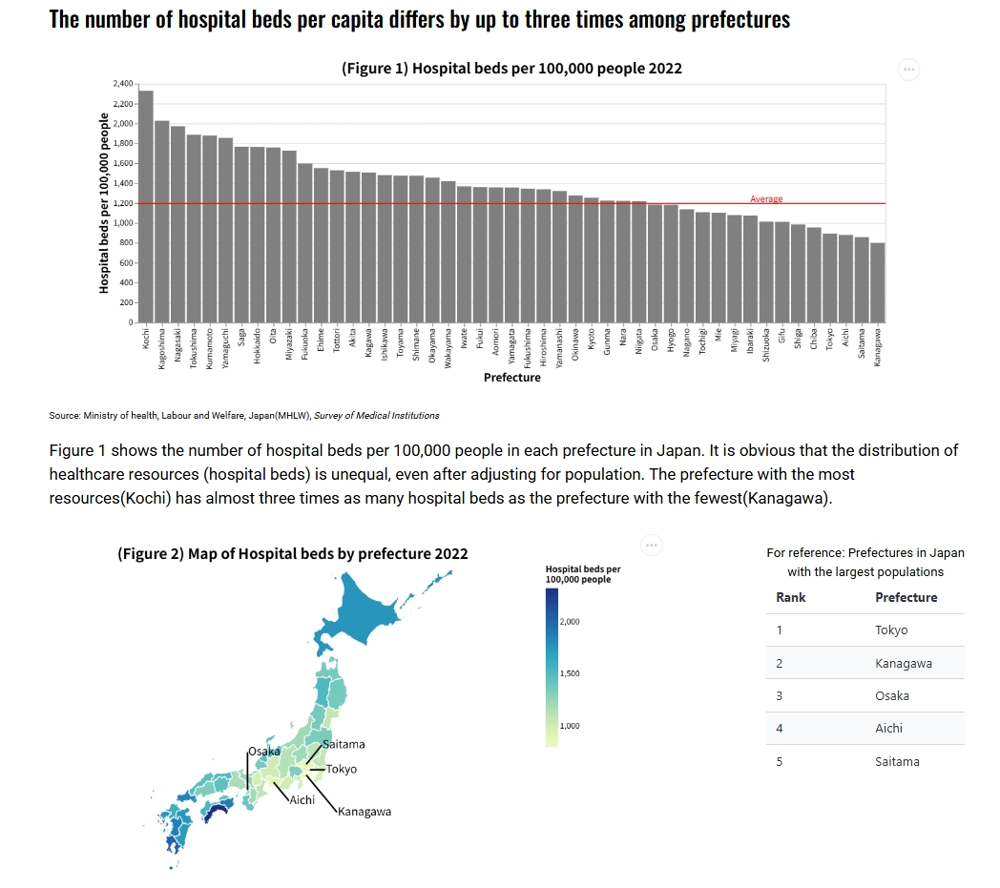

# Inefficiency in the distribution of medical resources in Japan

[**Inefficiency in the distribution of medical resources in Japan**](https://rshimizu63.github.io/Static-Visualization-rshimizu/)

Ryota Shimizu

## Description

I would like to show how local medical resources in Japan are unbalanced and overly concentrated in specific regions. In Japan, thanks to the universal health insurance system, all people can access sufficient medical services regardless of their wealth or location. However, since a large portion of medical expenditures is publicly covered, medical resources, especially hospital beds, are not necessarily distributed efficiently. This can lead to unnecessary expansion of medical expenditures. In this project, using prefecture-level data in Japan, I aim to demonstrate that an excessive concentration of hospital beds in certain prefectures can lead to the provision of unnecessary medical services, thereby increasing medical expenditures, while contributing relatively little to improving people’s health status.

You can hover some graphs to see detailed information.

## Data Sources
Ministry of health, Labour and Welfare, Japan, *Survey of Medical Institutions*
Ministry of health, Labour and Welfare, Japan, *National Medical Expenditure*
Ministry of health, Labour and Welfare, Japan, *Hospital Report*
Ministry of health, Labour and Welfare, Japan, *Healthy life expectancy in 2022*
Ministry of Internal Affairs and Communications, Japan, *Population Estimates*
