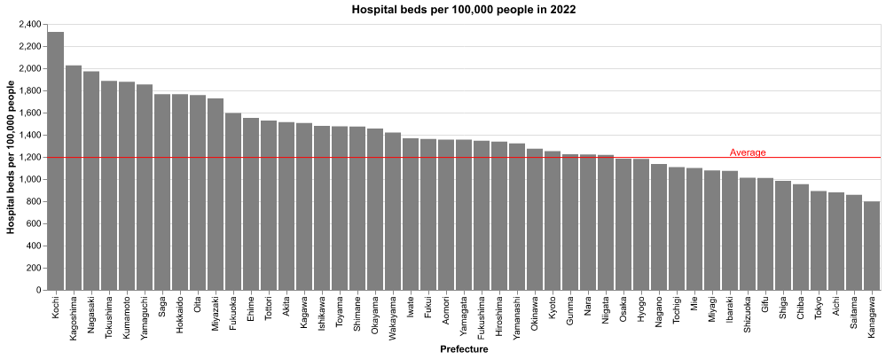
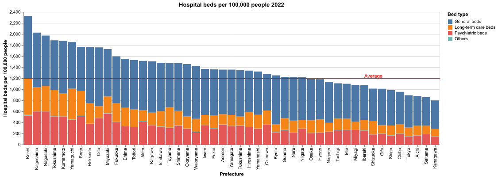
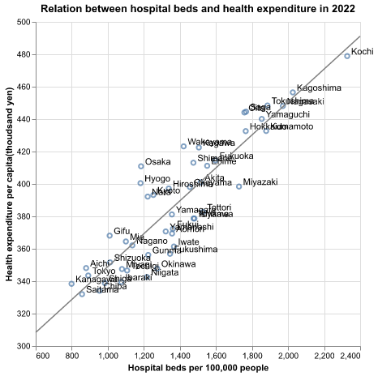
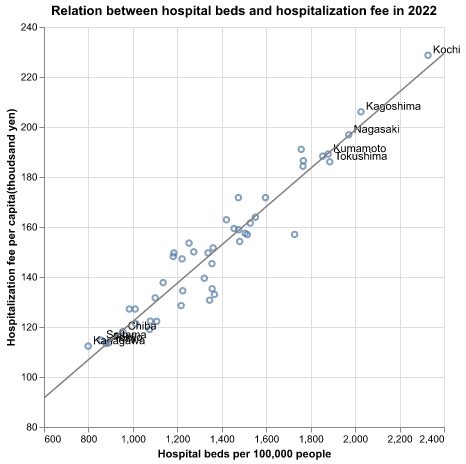
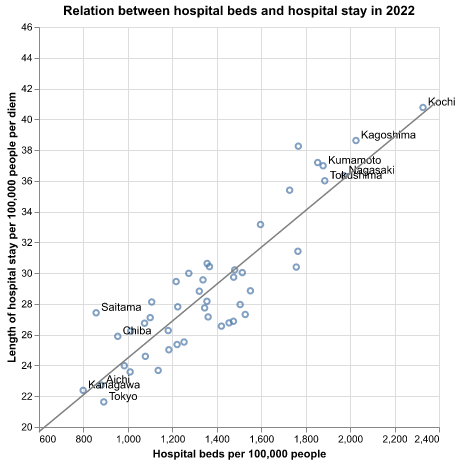
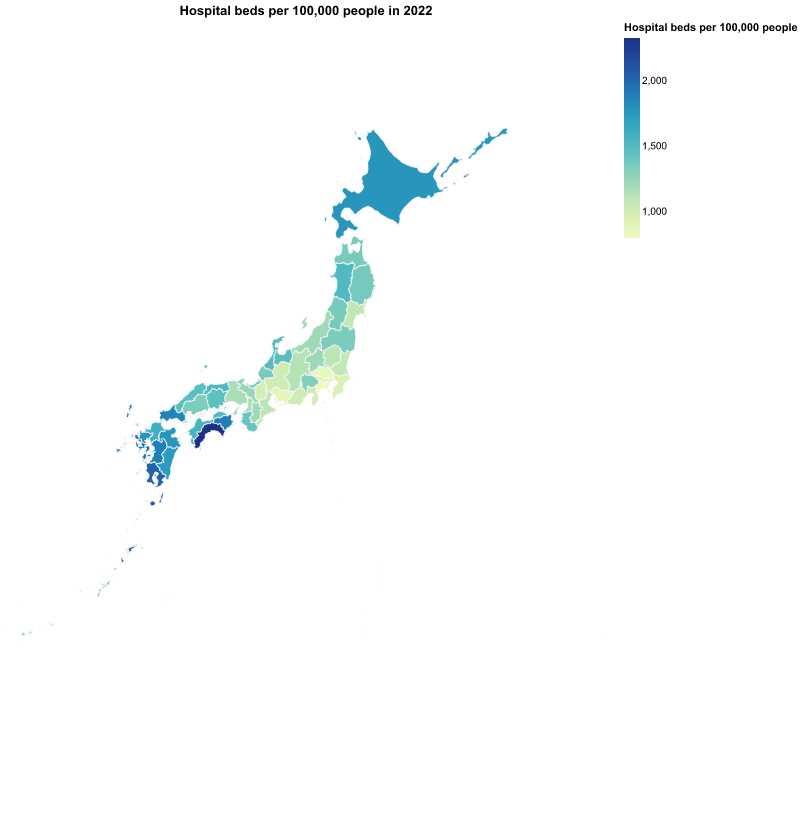
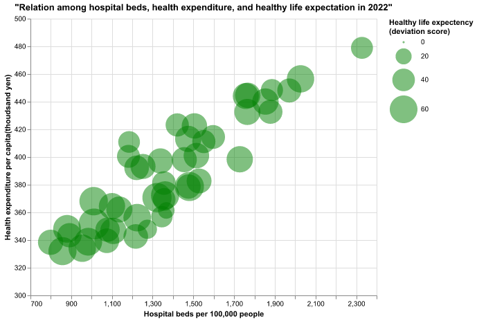
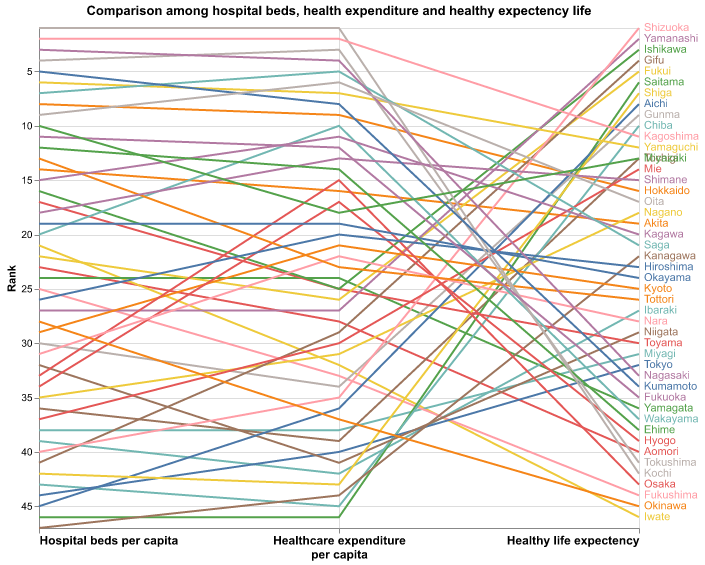
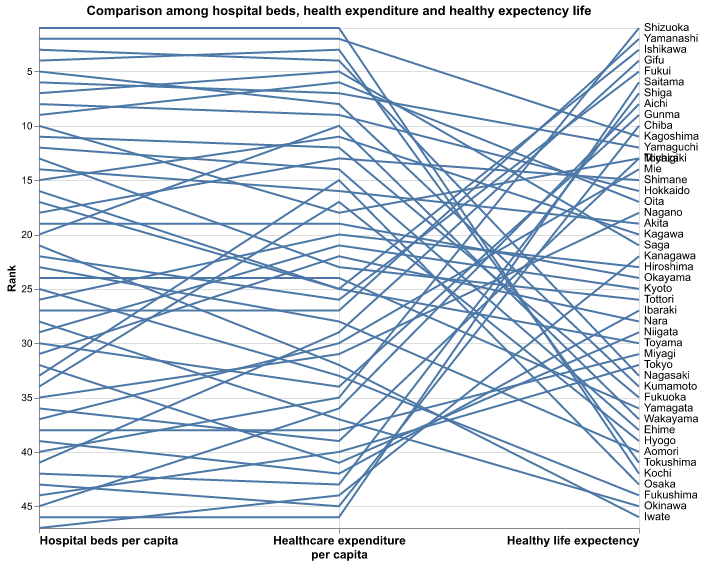

# The need to review and redistribute healthcare resources 

Ryota Shimizu

## What is your current goal? Has it changed since the proposal?
I would like to show how local medical resources in Japan are unbalanced and overly concentrated in specific regions. In Japan, thanks to the universal health insurance system, all people can access sufficient medical services regardless of their wealth or location. However, since a large portion of medical expenditures is publicly covered, medical resources, especially hospital beds, are not necessarily distributed efficiently. This can lead to unnecessary expansion of medical expenditures. In this project, using prefecture-level data in Japan, I aim to demonstrate that an excessive concentration of hospital beds in certain prefectures can lead to the provision of unnecessary medical services, thereby increasing medical expenditures, while contributing relatively little to improving people’s health status.

## Are there data challenges you are facing? Are you currently depending on mock data?
All data I'm using is real data, and there is no issue with using it so far. I don't use mock data.

## Describe each of the provided images with 2-3 sentences to give the context and how it relates to your goal.
1.Hospital beds per 100,000 people

This image shows the number of hospital beds per 100,000 people in each prefecture in Japan. The first and most important point is that the distribution of healthcare resources (hospital beds) is unequal, even after adjusting for population. The prefecture with the most resources has almost three times as many hospital beds as the prefecture with the fewest.

2.Hospital beds per 100,000 people by bed type

This image is basically same as the image 1 but we can see the breakdown of hospital beds. Although there are various types of beds, general beds and long-term care beds make up the majority.

3.Relation between hospital beds and health expenditure in 2022

This is a scatter plot showing the number of hospital beds and medical expenditure in each prefecture. Interestingly, the two variables are clearly highly correlated. This suggests that people in prefectures with many hospital beds bear a heavier burden of medical costs, and it is assumed that an over-allocation of hospital beds may cause some inefficiency.

4.Relation between hospital beds and hospitalization fee in 2022

This image is similar to Image 3, but the y-axis here represents hospitalization fees only, whereas in Image 3 it represents total healthcare costs. We can observe the same trend, and the correlation appears to be even stronger. It is assumed that higher medical expenditures are associated with more frequent or longer hospital stays, which may be influenced by the availability of hospital beds.

5.Relation between hospital beds and hospital stay in 2022

This graph shows the relationship between the number of hospital beds and the average length of hospital stay per 100,000 people. In general, the more hospital beds there are, the longer people tend to stay in the hospital.

6.Relation between hospital beds and new hospital admission in 2022

We compare the number of hospital beds with new hospital admissions per 100,000 people. Similar to hospital stays, prefectures with more hospital beds may also admit a larger number of patients.

7.Hospital beds in the map

This is a choropleth map showing the number of hospital beds per capita. It is particularly useful for those who are not familiar with Japan’s geography, as it provides an overview of the distribution of healthcare resources. Regional imbalances, such as the concentration of resources in the western regions, can also be observed. Although choropleth maps have the drawback that larger areas can appear visually exaggerated, this map also makes it clear that the over-supply of healthcare resources is not simply a function of geographic area.

8.Relation among the number of hospital beds, health expenditure, and healthy life expectency. 

This is a bubble chart, with the x-axis and y-axis the same as in Image 3. What is important, however, is whether such intensive investment in healthcare resources leads to better health outcomes. In this graph, the bubble size represents healthy life expectancy in deviation score. Although the x-axis and y-axis are correlated, the bubble size appears to be completely unrelated to the amount of medical expenditure.

9.Comparison among the number of hospital beds, health expenditure, and healthy life expectency. 

This graph also describe the relationship among hospital beds, health expenditure and healthy life expectency. X-axis represents the rank among prefectures about each factors. Since the number of hospital beds and health expenditure are correlated, relatively few lines cross each other. In contrast, healthcare expenditure and healthy life expectency are visibly tangled, indicating little apparent relationship. This suggests that the concentration of healthcare resources does not necessarily lead to improved health outcomes, and provides more compelling evidence for the need to optimize the allocation of medical resources.

## What form do you envision your final narrative taking? (e.g. An article incorporating the images? A poster? An infographic?)
I am envisioning an article incorporating the images. Rather than conveying the message immediately with a single figure, I want to structure it so that the argument is presented logically and step by step, because of the complexity of various factors.